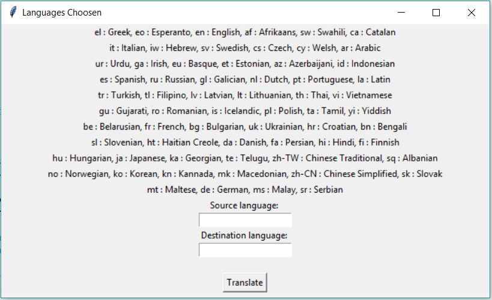

# Text-Translation-Using-Python
This repository represents a simple Graphical User Interface (GUI) to translate text from any language to another using python and google translate API.

# Using:
  In order to use this [GUI](Translation.ipynb):
  # First 
    You need to type the abbrevaiation of source language or you can choose the abbrevation from abbrevations listed in the GUI.
    
  # Second
    You need to type the abbrevaiation of destination language or you can choose the abbrevation from abbrevations listed in the GUI.
  
  # Third
    Click the Translate button to translate the text to the language you want.
